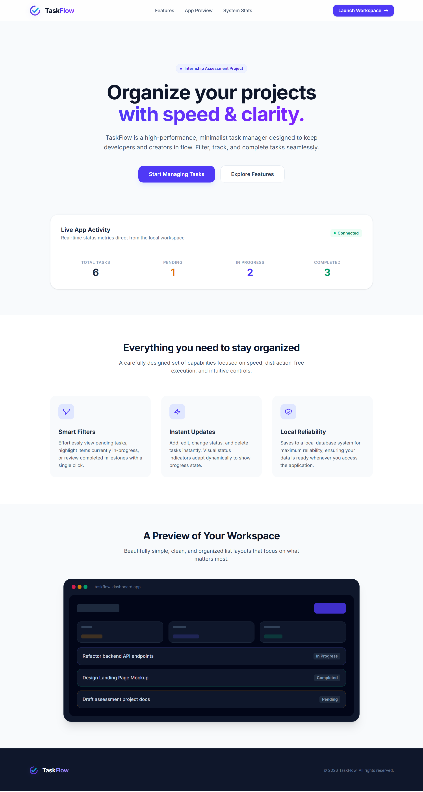
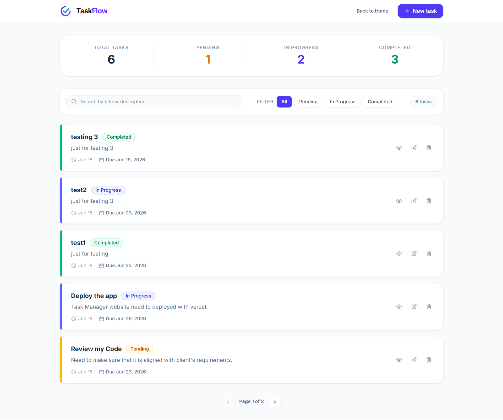

# TaskFlow — Frequenc Internship Assessment

A full-stack task management application built as part of the Frequenc internship assessment. The application allows users to create, view, update, filter, search, and delete tasks through a clean, modern interface backed by a RESTful API.

## Screenshots

### 1. Landing Page & Statistics Preview


### 2. Main Workspace (Task Manager Dashboard)


---

## Tech Stack

### Backend
- **Framework**: NestJS (Node.js)
- **Language**: TypeScript
- **Database**: SQLite (via `better-sqlite3`)
- **ORM**: TypeORM
- **Validation**: `class-validator` + `class-transformer`

### Frontend
- **Framework**: React 19 + Vite
- **Language**: TypeScript
- **Styling**: Tailwind CSS v4
- **HTTP Client**: Axios

---

## Project Structure

```
frequenc-intern-project/
├── backend/
│   ├── src/
│   │   ├── tasks/
│   │   │   ├── dto/
│   │   │   │   ├── create-task.dto.ts
│   │   │   │   └── update-task.dto.ts
│   │   │   ├── task.entity.ts
│   │   │   ├── tasks.controller.ts
│   │   │   ├── tasks.module.ts
│   │   │   └── tasks.service.ts
│   │   ├── app.module.ts
│   │   ├── app.controller.ts
│   │   ├── app.service.ts
│   │   └── main.ts
│   ├── package.json
│   └── .env.example
├── frontend/
│   ├── src/
│   │   ├── api/
│   │   │   └── tasks.ts
│   │   ├── components/
│   │   │   ├── Landing.tsx
│   │   │   ├── TaskList.tsx
│   │   │   ├── TaskForm.tsx
│   │   │   ├── TaskDetail.tsx
│   │   │   ├── TaskFilter.tsx
│   │   │   ├── StatusBadge.tsx
│   │   │   └── ConfirmDialog.tsx
│   │   ├── types/
│   │   │   └── task.ts
│   │   ├── App.tsx
│   │   ├── main.tsx
│   │   └── index.css
│   ├── package.json
│   └── .env.example
└── README.md
```

---

## Getting Started

### Prerequisites

- Node.js v18 or higher
- npm v9 or higher

---

### Backend Setup

```bash
# Navigate to the backend directory
cd backend

# Install dependencies
npm install

# Copy the environment example file and configure it
cp .env.example .env

# Start the development server
npm run start:dev
```

The backend server will run at: `http://localhost:3000`

#### Backend Environment Variables (`backend/.env`)

| Variable        | Default               | Description                         |
| --------------- | --------------------- | ----------------------------------- |
| `PORT`          | `3000`                | Port the NestJS server listens on   |
| `DATABASE_NAME` | `tasks.sqlite`        | SQLite database file name           |
| `FRONTEND_URL`  | `http://localhost:5173` | CORS allowed origin (frontend URL)  |

---

### Frontend Setup

```bash
# Navigate to the frontend directory
cd frontend

# Install dependencies
npm install

# Copy the environment example file and configure it
cp .env.example .env

# Start the development server
npm run dev
```

The frontend app will run at: `http://localhost:5173`

#### Frontend Environment Variables (`frontend/.env`)

| Variable       | Default                  | Description                      |
| -------------- | ------------------------ | -------------------------------- |
| `VITE_API_URL` | `http://localhost:3000`  | Backend API base URL             |

---

## API Reference

### Base URL
```
http://localhost:3000
```

### Task Endpoints

| Method   | Endpoint           | Description                              |
| -------- | ------------------ | ---------------------------------------- |
| `GET`    | `/tasks`           | Retrieve all tasks (optional `?status=`) |
| `GET`    | `/tasks/:id`       | Retrieve a single task by ID             |
| `POST`   | `/tasks/create`    | Create a new task                        |
| `PATCH`  | `/tasks/:id`       | Update an existing task by ID            |
| `DELETE` | `/tasks/:id`       | Delete a task by ID                      |

### Task Object Schema

```json
{
  "id": 1,
  "title": "Design landing page",
  "description": "Create the landing page mockup for the project",
  "status": "in_progress",
  "dueDate": "2026-07-01T00:00:00.000Z",
  "createdAt": "2026-06-18T10:00:00.000Z",
  "updatedAt": "2026-06-18T12:00:00.000Z"
}
```

### Task Status Values

| Value         | Description            |
| ------------- | ---------------------- |
| `pending`     | Task not yet started   |
| `in_progress` | Task currently active  |
| `completed`   | Task finished          |

### Create Task — Request Body

```json
{
  "title": "string (required, max 100 chars)",
  "description": "string (optional, max 500 chars)",
  "status": "pending | in_progress | completed (optional)",
  "dueDate": "ISO 8601 date string (optional)"
}
```

---

## Features

- **Landing Page** — A professional introduction page with live app statistics, feature highlights, and an interactive dashboard preview.
- **Task CRUD** — Create, read, update, and delete tasks via a modal form and confirmation dialogs.
- **Status Filtering** — Filter tasks by `All`, `Pending`, `In Progress`, or `Completed` status.
- **Search** — Real-time search of tasks by title.
- **Pagination** — Tasks are paginated at 5 items per page with `<` / `>` navigation controls.
- **Validation** — Backend request bodies are validated using `class-validator` decorators on DTOs.
- **Loading, Error & Empty States** — All UI states (loading spinner, connection error with retry, and no-task empty state) are handled and displayed to the user.
- **Responsive Design** — The UI is fully responsive across mobile, tablet, and desktop viewports.

---

## Design Decisions

- **SQLite** was chosen for the database to keep the setup simple and zero-dependency for a local assessment environment — no external database server required.
- **NestJS `ValidationPipe`** is configured globally with `whitelist: true` and `forbidNonWhitelisted: true` to strip and reject any unexpected fields in request payloads.
- **TypeORM `synchronize: true`** is used in development to auto-create the database schema from entities, removing the need for manual migrations.
- **Vite** environment variables are prefixed with `VITE_` so they are safely exposed to the browser bundle at build time.